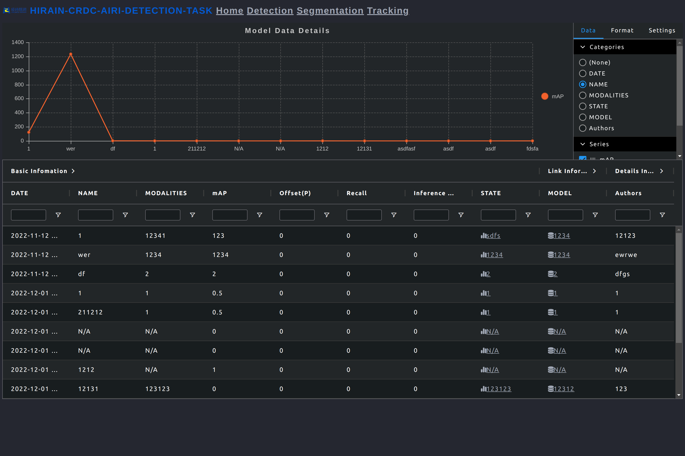

# Deep learning Model Release Summary Tool

## Description

* This project gives you a whole frontend and backend solution about display the deployed model states.
* The backend use springboot with api doc by swagger-ui.
* The frontend use jquery with ad-grid which is a good grid table and chat render component.

